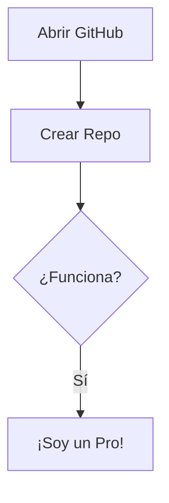

### Vamos a crear un pequeño archivo de pruebas para entrenar el uso conjunto de VScode y GitHub
Para ello vamos a crear este archivo conjunto de Markdown y Mermaid
___

```mermaid
graph TD;
    A[Abrir GitHub] --> B[Crear Repo];
    B --> C{¿Funciona?};
    C -- Sí --> D[¡Soy un Pro!];
```
